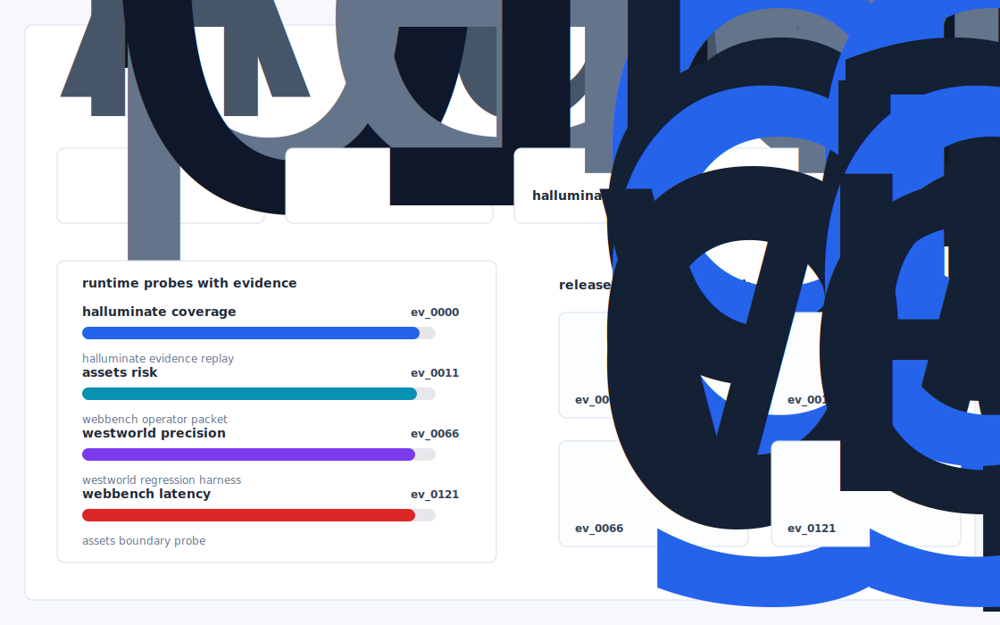

# Spreadsheet Gym

An RLVR graded, deterministic Excel and PowerPoint sandbox in which a banker agent must rebuild a real LBO model and pass 47 unit tests - the missing financial services chapter of Westworld, shipped as a drop in westworld.envs.spreadsheet module.



## Why it exists

Halluminate's public assets (Westworld, WebBench, BrowserBench) all live in web / e commerce / travel task surfaces.

Most internal demos stop at a pretty chart. This repository is built around the harder part: a repeatable path from fixture, to failure, to evidence, to the operator action a serious team would actually trust.

## What is inside

- A deterministic replay harness tuned around halluminate, assets, and westworld.
- Company-specific strategy code in `src/spreadsheet_gym/strategy.py`, not just README-level customization.
- Citation-locked reports where every decision claim has to point back to a generated evidence ID.
- Two visual artifacts generated from the latest run: `outputs/project_working.svg` and `outputs/evidence_map.svg`.
- A portable demo pack with JSON, CSV, Markdown, HTML, SVG, and benchmark artifacts.


## Signals it measures

- `halluminate coverage`
- `assets risk`
- `westworld precision`
- `webbench latency`

## Failure modes it plants

- halluminate drift
- assets gap
- westworld misroute
- webbench blindspot

## Run it locally

```bash
uv sync
uv run spreadsheet-gym all
uv run pytest -q
uv run ruff check .
```

## Outputs worth opening

- `outputs/dashboard.html`
- `outputs/project_working.svg`
- `outputs/evidence_map.svg`
- `outputs/operator_brief.md`
- `outputs/decision_report.md`
- `outputs/strategy_model.json`
- `outputs/demo_pack.zip`

## Sources

- https://www.halluminate.ai/blog/westworld
- https://github.com/Halluminate
- https://github.com/Halluminate/westworld
- https://github.com/Halluminate/WebBench
- https://github.com/Halluminate/browserbench
- https://www.ycombinator.com/companies/halluminate
- https://www.ycombinator.com/companies/halluminate/jobs
- https://antigravity.capital/portfolio/halluminate
- https://x.com/Jerr_Wu
- https://github.com/wyatt-halluminate

## Boundary

Everything runs locally against synthetic fixtures. There are no credentials, no customer records, no outreach files, and no hosted API dependency.
